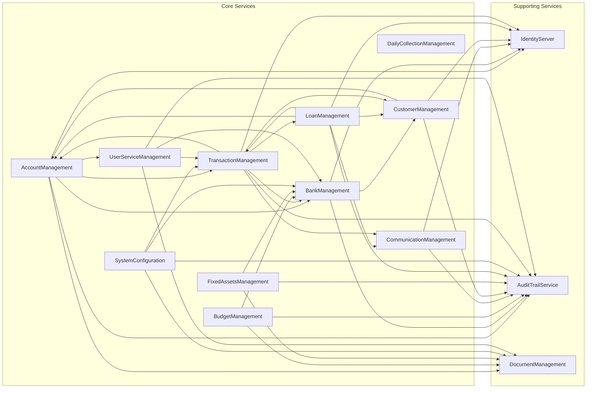

# Rapport d'Analyse Architecturale et Métier : Écosystème SampleFluxProject

Ce document présente une analyse récursive et profonde de l'écosystème `SampleFluxProject`, basée exclusivement sur l'exploration du code source.

---

## Partie I : La Constitution de l'Écosystème (Analyse Architecturale)

### 1. Le "Génome" d'un Microservice Standard

L'analyse des services (`CustomerManagement`, `AccountManagement`, etc.) révèle une architecture à 7 couches cohérente et récurrente, construite sur des composants "boilerplate" fondamentaux.

- **`IGenericRepository.cs` / `GenericRepository.cs`**:
    - **Rôle**: Fournit une abstraction standard pour les opérations CRUD.
    - **Logique Clé**: Implémente une stratégie de **soft delete** (`IsDeleted`) et utilise `AsNoTracking()` pour les lectures afin d'améliorer les performances.

- **`IUnitOfWork.cs` / `UnitOfWork.cs`**:
    - **Rôle**: Centralise la gestion des transactions de la base de données.
    - **Logique Clé**: Implémente un **mécanisme d'audit automatique**. Avant `SaveChanges()`, il peuple automatiquement les champs d'audit (`CreatedBy`, `CreatedDate`, etc.) en utilisant un `UserInfoToken` injecté pour récupérer l'identité de l'utilisateur.

- **`ServiceResponse.cs`**:
    - **Rôle**: Standardise la structure de toutes les réponses d'API.
    - **Logique Clé**: Utilise un pattern "Factory" (`ReturnSuccess`, `ReturnFailed`, etc.) pour créer des objets de réponse cohérents. Ce fichier est copié dans chaque microservice pour maximiser le découplage.

- **`ValidationBehavior.cs`**:
    - **Rôle**: Pipeline MediatR pour valider automatiquement les requêtes avant qu'elles n'atteignent leurs handlers.
    - **Logique Clé**: Utilise `FluentValidation`. En cas d'échec, il court-circuite la requête et retourne une `ServiceResponse` avec un statut `422`.

- **`BaseController.cs`**:
    - **Rôle**: Contrôleur de base pour tous les autres, standardisant le formatage des réponses HTTP.
    - **Logique Clé**: Fournit une méthode `ReturnFormattedResponse<T>` qui transforme la `ServiceResponse<T>` interne en une `IActionResult` HTTP standard.

### 2. La Chaîne de Configuration et d'Exécution

`Startup.cs` révèle un pipeline de middlewares critique pour la sécurité :
1.  `UseExceptionHandler`
2.  `UseSwagger`
3.  `UseHttpsRedirection`
4.  `UseAuthentication`: Valide le JWT.
5.  `UseMiddleware<JWTMiddleware>`: Middleware personnalisé qui peuple l'objet `UserInfoToken` avec les informations du token validé. C'est le lien entre l'authentification et l'audit.
6.  `UseAuthorization`: Applique les règles d'autorisation.
7.  `UseEndpoints`: Envoie la requête au contrôleur.

### 3. Le Socle de Communication (`Common`)

- **`ApiCallerHelper.cs`**: Wrapper `HttpClient` qui propage automatiquement le JWT de l'utilisateur dans les en-têtes des requêtes inter-services.
- **`ServiceDiscoveryExtension.cs`**: Contient la logique pour l'intégration avec **Consul** pour l'enregistrement et la découverte de services.

### 4. Le Portail de Sécurité (`ApiGateway`)

`ocelot.json` définit l'ApiGateway comme le portail de sécurité central.
- **Routage**: Mappe les URL publiques aux services internes.
- **Sécurité Centralisée**: Applique l'authentification JWT, l'autorisation par "claims" et le rate limiting (100 req/min) à la périphérie.
- **Contradiction Architecturale**: Bien que la configuration globale active Consul pour la découverte de services, les routes individuelles utilisent des adresses de service **statiques et hardcodées**, désactivant de fait la découverte dynamique.

---

## Partie II : Dissection Métier de Chaque Microservice

### 1. `AccountManagement`
-   **Rôle Métier**: Le **Grand Livre (General Ledger)** du système. Source de vérité pour les opérations comptables, soldes, et rapports financiers.
-   **Entités Clés**: `Account`, `ChartOfAccount`, `AccountingEntry`, `AccountingRule`, `Budget`.
-   **Logique Spécifique**: `MakeAccountPostingCommandHandler` orchestre la comptabilisation des transactions, incluant la validation de la règle de la partie double (`debits == credits`).
-   **Dépendances**: `IdentityServer`, `AuditTrail`, `DocumentManagement`, `BankManagement`, `TransactionManagement`, `UserServiceManagement`, `TellerProvisioning`.

### 2. `BankManagement`
-   **Rôle Métier**: Référentiel de la **structure organisationnelle et géographique** de la banque.
-   **Entités Clés**: `Bank`, `Branch`, `BankingZone`, `Country`, `Currency`, `ThirdPartyInstitution`, `DocumentUploaded`.
-   **Logique Spécifique**: Utilise une **persistance hybride**. La relation entre les agences et les zones (`BankZoneBranch`) est stockée dans **MongoDB**, tandis que le reste est dans SQL Server.
-   **Dépendances**: `IdentityServer`, `CustomerManagement`.

### 3. `BudgetManagement`
-   **Rôle Métier**: Gestion des **budgets d'entreprise** et suivi des dépenses.
-   **Entités Clés**: `FiscalYear`, `BudgetPlan`, `BudgetItem`, `Expenditure`, `SpendingLimit`.
-   **Logique Spécifique**: `AddExpenditureCommandHandler` est étonnamment simple. Il enregistre les dépenses mais **ne valide pas** si elles dépassent le budget alloué, ce qui suggère un système de *suivi* budgétaire plutôt que d'application stricte du budget.
-   **Dépendances**: `AuditTrail`, `BankManagement`, `DocumentManagement`.

### 4. `CommunicationManagement`
-   **Rôle Métier**: Hub centralisé pour l'envoi de **SMS, email, et notifications push**.
-   **Entités Clés**: Largement sans état. Son `DbContext` SQL ne contient que des `AuditLog`. Utilise **MongoDB** pour persister un journal de chaque `Notification` envoyée.
-   **Logique Spécifique**: Agit comme une passerelle vers des fournisseurs externes. `SendSingleSmsCommandHandler` contient une logique de **normalisation des numéros de téléphone** (ajout du préfixe `+237`).
-   **Dépendances**: `IdentityServer`, `AuditTrail`.

### 5. `CustomerManagement`
-   **Rôle Métier**: **CRM** et système de gestion des "parties" (individus, groupes, employés).
-   **Entités Clés**: `Customer`, `Group`, `Organization`, `Employee`, `PhoneNumberChangeHistory`, `UploadedCustomerWithError`.
-   **Logique Spécifique**: Le `UploadCustomerFileCommandHandler` est un moteur d'importation de données robuste qui utilise `NPOI` pour parser des fichiers Excel, délègue la création via MediatR, et possède une logique de **nettoyage de données et de nouvelles tentatives** en cas d'échec.
-   **Dépendances**: `IdentityServer`, `AuditTrail`, `AccountManagement`.

### 6. `DailyCollectionManagement`
-   **Rôle Métier**: Gestion d'un réseau d'agents de collecte.
-   **Analyse**: Ce service est un **placeholder ou est incomplet**. Il n'a pas de contrôleurs implémentés ni de logique métier significative. Ses entités (`Agent`, etc.) ne sont même pas enregistrées dans son `DbContext`.

### 7. `FixedAssetsManagement`
-   **Rôle Métier**: Gestion du cycle de vie des **immobilisations** de l'entreprise.
-   **Entités Clés**: `Asset`, `AssetType`, `Location`, `DepreciationMethod`, `DepreciationEntry`, `AssetTransfer`, `AssetDisposal`.
-   **Logique Spécifique**: Le `AddDepreciationEntryCommandHandler` **ne calcule pas** la dépréciation. Il reçoit le montant calculé en paramètre. Cela implique que la logique de calcul financier complexe est effectuée par un **processus externe** (par exemple, un batch de fin de mois), et ce service agit comme un simple système d'enregistrement (CRUD).
-   **Dépendances**: `AuditTrail`, `BankManagement`, `DocumentManagement`.

### 8. `LoanManagement`
-   **Rôle Métier**: Gestion du cycle de vie complet d'un **prêt**, de la demande à la radiation.
-   **Entités Clés**: `LoanProduct`, `LoanApplication`, `Loan`, `LoanAmortization`, `Refund`, `LoanCommiteeGroup`, `Collateral`.
-   **Logique Spécifique**: La logique de calcul financier est encapsulée dans une classe helper statique, `LoanCalculator`. Le `AddLoanAmortizationHandler` délègue à cette classe la tâche complexe de générer le tableau d'amortissement.
-   **Dépendances**: `AccountManagement`, `CustomerManagement`, `CommunicationManagement`, `IdentityServer`, `AuditTrail`.

### 9. `SystemConfiguration`
-   **Rôle Métier**: Gestion des **données de référence géographiques** (`Country`, `Region`, `Town`, etc.).
-   **Logique Spécifique**: Service CRUD simple. Sa "logique" principale réside dans les relations hiérarchiques et les contraintes définies dans `OnModelCreating` de son `DbContext`.
-   **Dépendances**: `AuditTrail`, `BankManagement`, `TransactionManagement`, `DocumentManagement`.

### 10. `TransactionManagement`
-   **Rôle Métier**: **Orchestrateur des Opérations Financières**. Il gère le cycle de vie de toutes les transactions (transferts, dépôts, etc.), applique les frais et les politiques.
-   **Entités Clés**: `Transaction`, `Teller`, `Vault`, `ReversalRequest`, et une multitude d'entités `...Parameter` qui définissent les règles métier (ex: `WithdrawalParameter`).
-   **Logique Spécifique**: Le `AddRemittanceHandler` est un excellent exemple. Il recherche les politiques de frais, calcule et répartit les commissions entre les agences et le siège social en fonction des pourcentages configurés.
-   **Dépendances**: `AccountManagement`, `CustomerManagement`, `LoanManagement`, `CommunicationManagement`, `BankManagement`, `IdentityServer`, `AuditTrail`.

### 11. `UserServiceManagement`
-   **Rôle Métier**: **IAM (Identity and Access Management)** pour les utilisateurs internes (le personnel).
-   **Entités Clés**: `User` (avec des champs comme `FirstName`, `Email`, `Role`).
-   **Logique Spécifique**: Service CRUD très simple. L'authentification réelle est déléguée à un `IdentityServer` externe ; ce service agit probablement comme le "magasin d'utilisateurs" pour ce serveur.
-   **Dépendances**: `AuditTrail`, `BankManagement`, `TransactionManagement`, `DocumentManagement`.

---

## Partie III : Analyse des Synergies et Flux Transversaux

### 1. Cartographie Complète des Interactions

### 2. Analyse d'un Flux Métier Complexe : Création d'un Client
1.  **ApiGateway** reçoit la requête et la route vers `CustomerManagement`.
2.  `CustomerManagement` crée l'entité `Customer` dans sa base de données.
3.  `CustomerManagement` appelle ensuite `AccountManagement` pour créer les comptes financiers par défaut pour ce client.
4.  `AccountManagement` crée les entités `Account` et les sauvegarde.
5.  Les deux services enregistrent des logs d'audit dans `AuditTrailService`.
6.  La réponse finale est retournée au client.

### 3. Le Standard de Contrat de Données (DTOs)
L'analyse de l'appel de `BankManagement` à `CustomerManagement` prouve l'approche de **copie locale des DTOs**.
-   `BankManagement` utilise `CoreServices/BankManagement/CBS.BankMGT.Data/APIRequestObjects/CustomerApiRequest.cs`.
-   `CustomerManagement` reçoit ceci dans un `CoreServices/CustomerManagement/CBS.CUSTOMER.MEDIATR/Global/Command/AddDocumentCommand.cs`.
-   Les deux classes sont **structurellement identiques**, mais ne sont pas partagées via une librairie commune, ce qui maximise le découplage entre les services.
