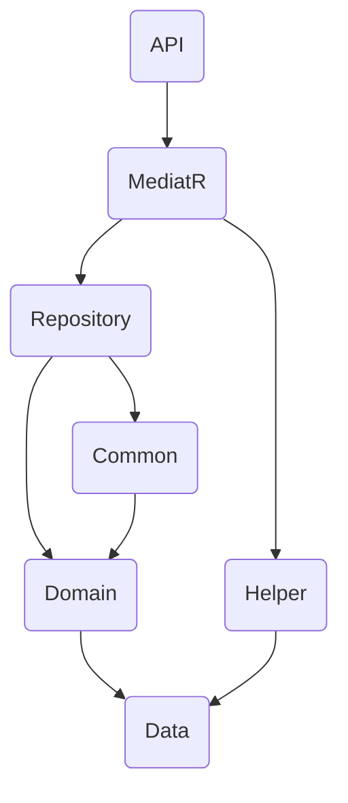

# Guide de Maîtrise de l'Architecture Microservices .NET

Ce document sert de guide de référence complet pour comprendre, maîtriser et étendre l'architecture microservices de l'écosystème CBS.

## Partie I : La Vision d'Ensemble (Le "Pourquoi")

Cette section explique la philosophie et les grands choix stratégiques qui sous-tendent l'architecture.

### 1.1. Le Macrosystème Architectural

L'architecture est organisée en trois ensembles principaux qui collaborent pour former un écosystème robuste et évolutif :

*   **`API GATEWAY`**: Il s'agit du point d'entrée unique pour toutes les requêtes externes. Basé sur la librairie **Ocelot**, son rôle est multiple :
    *   **Routage :** Il redirige les requêtes publiques (ex: `/Api/Gateway/Fluxcam/Loan/...`) vers le microservice interne approprié (`localhost:7041`).
    *   **Authentification Centralisée :** Il effectue une première validation des tokens JWT (`AuthenticationProviderKey: "Bearer"`) avant de laisser passer la requête, sécurisant ainsi l'ensemble de l'écosystème.
    *   **Gestion des Problématiques Transverses :** Il prend en charge des fonctionnalités comme le rate-limiting pour protéger les services en aval.

*   **`COMMON`**: Ce dossier contient des projets de librairies partagées, conçues pour être réutilisées par tous les microservices. L'objectif est de ne pas réinventer la roue et de standardiser les fonctionnalités communes :
    *   **`APICallerHelper`**: Fournit une manière standardisée d'effectuer des appels HTTP entre les microservices.
    *   **`CustomerLoggerHelper`**: Offre des configurations et des classes d'aide pour le logging.
    *   **`ServiceDiscovery`**: Contient la logique pour s'enregistrer et découvrir des services via **Consul**.

*   **`CORE SERVICES`**: C'est le cœur de l'application. Chaque sous-dossier (ex: `LoanManagement`, `TransactionManagement`) est un **microservice indépendant** qui représente un domaine métier spécifique. Chaque service a sa propre base de code, sa propre logique, et potentiellement sa propre base de données, ce qui garantit une grande autonomie et une séparation claire des responsabilités.

### 1.2. Les Piliers Architecturaux

La solution repose sur plusieurs patterns et choix architecturaux majeurs pour garantir sa robustesse et sa maintenabilité :

*   **Architecture Microservices :** Le choix principal. Permet de diviser une application complexe en services plus petits et indépendants. Cela facilite le développement, le déploiement et la mise à l'échelle de chaque domaine métier de manière autonome.
*   **Clean Architecture :** Appliquée au sein de chaque microservice (voir Partie II), elle impose une séparation stricte des préoccupations (Présentation, Application, Domaine, Infrastructure) et un flux de dépendances unidirectionnel vers le centre (le Domaine), rendant le code plus testable et moins couplé.
*   **CQRS (Command Query Responsibility Segregation) :** L'utilisation intensive de la librairie **MediatR** pour séparer les opérations de lecture (`Query`) des opérations d'écriture (`Command`) est une implémentation claire de ce pattern. Cela permet d'optimiser chaque type d'opération indépendamment.
*   **Service Discovery :** L'intégration de **Consul** dans l'API Gateway et dans la librairie `Common` montre une volonté de permettre aux services de s'enregistrer et de se trouver dynamiquement sur le réseau, ce qui est essentiel pour un environnement microservices résilient.

### 1.3. La Stack Technologique

*   **.NET 8.0 :** Le framework principal, moderne, performant et multiplateforme.
*   **Entity Framework Core :** L'ORM (Object-Relational Mapper) utilisé pour la communication avec la base de données SQL Server.
*   **MediatR :** La librairie qui implémente le pattern Mediator, utilisée ici pour le CQRS.
*   **Ocelot :** La librairie .NET utilisée pour construire l'API Gateway.
*   **Consul :** L'outil de service discovery utilisé par l'écosystème.
*   **JWT (JSON Web Tokens) :** Le standard utilisé pour l'authentification et la transmission sécurisée d'informations utilisateur entre les services.
*   **NLog / Serilog :** Les librairies utilisées pour le logging applicatif.
*   **FluentValidation :** Utilisée pour la validation des objets de commande (DTOs) de manière déclarative et robuste.

---

## Partie II : L'Anatomie d'un Microservice (Le "Quoi")

Cette section détaille la structure interne standard qui doit être respectée par chaque microservice pour garantir la cohérence et la maintenabilité.

### 2.1. La Structure à 7 Couches

Chaque microservice est découpé en 7 projets, chacun ayant un rôle bien défini, conformément aux principes de la Clean Architecture.

*   **1. `API`**
    *   **Rôle :** Point d'entrée du service. Gère les requêtes HTTP, la sérialisation/désérialisation JSON, et l'authentification/autorisation.
    *   **Structure :** Contient les `Controllers`, les `Middlewares`, `Startup.cs`, `Program.cs` et les fichiers de configuration.
    *   **Objets :** Uniquement des `Controllers` qui reçoivent des requêtes et les transmettent immédiatement à MediatR. **Aucune logique métier ici.**

*   **2. `MediatR`**
    *   **Rôle :** Couche applicative. C'est ici que la logique d'orchestration réside.
    *   **Structure :** Contient les objets `Command` et `Query` ainsi que leurs `Handlers` respectifs.
    *   **Objets :** Les `Handlers` reçoivent les requêtes de l'API, les valident, et appellent les repositories ou d'autres services pour accomplir une tâche.

*   **3. `Domain`**
    *   **Rôle :** Le cœur du métier. Contient les règles et les objets métier les plus importants.
    *   **Structure :** Contient le `DbContext` (ex: `TransactionContext.cs`) et les migrations de la base de données.
    *   **Objets :** Le `DbContext` qui définit la structure de la base de données via les `DbSet<T>`.

*   **4. `Data`**
    *   **Rôle :** Contient les contrats de données et les objets qui représentent les données.
    *   **Structure :** Contient les dossiers `Entity` et `Dto`.
    *   **Objets :**
        *   **`Entities`**: Classes qui mappent directement les tables de la base de données. Elles héritent de `BaseEntity`.
        *   **`DTOs` (Data Transfer Objects)**: Classes utilisées pour transférer des données entre les couches et les services.

*   **5. `Repository`**
    *   **Rôle :** Couche d'accès aux données. Abstrait la logique de la base de données.
    *   **Structure :** Contient les implémentations concrètes des interfaces de repository (ex: `TransactionRepository.cs`).
    *   **Objets :** Des classes `Repository` qui utilisent le `DbContext` pour effectuer les opérations CRUD.

*   **6. `Common`**
    *   **Rôle :** Contient les composants techniques réutilisables au sein d'un même microservice.
    *   **Structure :** Contient les implémentations des patterns `GenericRepository` et `UnitOfWork`.
    *   **Objets :** `GenericRepository.cs`, `UnitOfWork.cs` et leurs interfaces.

*   **7. `Helper`**
    *   **Rôle :** Librairie d'utilitaires et de classes d'aide.
    *   **Structure :** Contient des classes comme `ServiceResponse<T>` et `ApiCallerHelper.cs`.
    *   **Objets :** Classes statiques ou services fournissant des fonctionnalités transverses (communication, formatage de réponse).

### 2.2. Le Graphe de Dépendances

Ce diagramme illustre le flux de dépendances, qui est la clé de la Clean Architecture. Les couches externes dépendent des couches internes, mais jamais l'inverse.



**Justification :** Ce flux garantit que le cœur de l'application (le `Domain` et la `Data`) ne dépend d'aucun détail d'implémentation (comme l'API ou la base de données). On peut changer la manière dont on expose l'API ou la technologie de base de données sans jamais toucher à la logique métier, ce qui rend l'architecture extrêmement flexible et résiliente.

---

## Partie III : La Mécanique Interne (Le "Comment")

Cette section explique le flux d'exécution d'une requête de bout en bout, en prenant l'exemple d'une opération d'écriture (une commande).

### 3.1. Le Flux d'une Commande (Écriture)

Voici le parcours détaillé d'une requête `POST` pour créer une nouvelle ressource :

1.  **Point d'Entrée (`Controller`)**: La requête HTTP `POST` arrive sur un endpoint de l'API, par exemple `PingsController`. Le corps de la requête est désérialisé en un objet `AddPingCommand`.

2.  **Dispatch MediatR**: Le contrôleur ne fait qu'une seule chose : il envoie la commande au pipeline MediatR via `await _mediator.Send(command);`. Il ne connaît rien de la logique qui va suivre.

3.  **Pipeline MediatR (`ValidationBehavior`)**: Avant d'atteindre le handler, la commande est interceptée par le `ValidationBehavior`. Ce dernier trouve le validateur `FluentValidation` associé à la commande (`AddPingCommandValidator`) et l'exécute. Si la validation échoue, une `ValidationException` est levée, ce qui arrête le processus et retourne une erreur 422.

4.  **Exécution du `Handler`**: Si la validation réussit, MediatR transmet la commande au handler correspondant, `AddPingCommandHandler`. C'est ici que réside toute la logique d'application.

5.  **Logique d'Application**: Le handler orchestre les opérations :
    a. Il crée une nouvelle `Entity` (`Ping`) à partir des données de la `Command`.
    b. Il utilise le `Repository` injecté (`_pingRepository.Add(entity)`) pour marquer la nouvelle entité comme devant être ajoutée à la base de données.
    c. **Il n'appelle PAS directement `DbContext.SaveChanges()`**.

6.  **Persistance des Données (`UnitOfWork`)**: Le handler appelle `await _uow.SaveAsync(_userInfoToken);`. C'est cette action qui déclenche la persistance.

7.  **Logique d'Audit Automatique**: Juste avant de sauvegarder, la méthode `SaveAsync` de l'`UnitOfWork` parcourt toutes les entités suivies par le `DbContext`. Si une entité est à l'état `Added`, elle utilise le `UserInfoToken` (qui a été peuplé par le `JWTMiddleware` et injecté) pour remplir automatiquement les champs `CreatedBy` et `CreatedDate`.

8.  **Transaction et Sauvegarde**: L'`UnitOfWork` exécute `await Context.SaveChangesAsync()` à l'intérieur d'une transaction de base de données, garantissant que toutes les modifications sont atomiques.

9.  **Retour de la Réponse**: Le handler retourne un `ServiceResponse<T>` avec les données et un statut de succès.

10. **Formatage de la Réponse (`BaseController`)**: Le contrôleur reçoit le `ServiceResponse` et utilise sa méthode `ReturnFormattedResponse` pour le transformer en une réponse HTTP `200 OK` (ou `201 Created`) avec un corps JSON standardisé.

### 3.2. La Communication Inter-Services

La communication entre les microservices est gérée par la classe `ApiCallerHelper`.
-   Elle est utilisée dans les `Handlers` MediatR lorsqu'un service a besoin de données d'un autre.
-   Elle obtient l'URL du service cible via **Consul** (théoriquement, bien que les routes soient statiques dans `ocelot.json`).
-   Elle propage automatiquement le **token JWT** de l'utilisateur courant, assurant que l'appel au service distant est authentifié.
-   Elle utilise un pattern de **copie locale des DTOs** : le service appelant ne référence pas directement le projet `Data` du service appelé. Il définit sa propre version du DTO attendu. Cela garantit un **découplage maximal** ; une modification du DTO dans un service ne casse pas les autres services qui l'appellent.

---

## Partie IV : La Constitution - Les Standards Non-Négociables

Cette section liste les "lois" que tout développeur doit impérativement respecter pour maintenir la cohérence, la sécurité et la qualité de l'écosystème.

### 4.1. Le Pilier de la Sécurité

*   **Cycle de vie du `UserInfoToken`**: C'est l'objet qui transporte l'identité de l'utilisateur à travers une requête.
    1.  Le `JWTMiddleware` intercepte le token JWT entrant.
    2.  Il valide le token et en extrait les `claims` (Id, Email, BranchID, etc.).
    3.  Il utilise ces claims pour peupler une instance de `UserInfoToken`, qui est injectée en `Scoped` dans le conteneur de dépendances.
    4.  Ainsi, n'importe quelle classe plus bas dans la pile d'appel (Handlers, Repositories, UnitOfWork) peut obtenir les informations de l'utilisateur courant simplement en demandant `UserInfoToken` dans son constructeur.

*   **Authentification et Autorisation**:
    *   L'authentification est gérée par le pipeline `AddAuthentication().AddJwtBearer()` dans `Startup.cs`.
    *   L'autorisation se fait de manière déclarative sur les endpoints des contrôleurs avec l'attribut `[Authorize]`. Pour restreindre un endpoint à un rôle spécifique, on utilise `[Authorize(Roles = "Admin")]`.

*   **Validation des Entrées**:
    *   Toute `Command` MediatR qui reçoit des données d'une source externe **doit** avoir un validateur `FluentValidation` associé.
    *   Le `ValidationBehavior` injecté dans le pipeline MediatR exécute automatiquement ce validateur, garantissant qu'aucune donnée invalide n'atteint jamais un `Handler`.

### 4.2. Les Patterns de Code Obligatoires

*   **Réponses API (`ServiceResponse<T>`)**:
    *   Toutes les méthodes de `Handler` MediatR **doivent** retourner un `ServiceResponse<T>`.
    *   Pour construire la réponse, on **doit** utiliser les méthodes "factory" statiques : `ServiceResponse<T>.Return200(data)`, `ServiceResponse<T>.Return404()`, etc.
    *   Ceci garantit que toutes les réponses de l'API à travers tous les microservices ont une structure JSON cohérente et prédictible.

*   **Accès aux Données (`Repository` & `UnitOfWork`)**:
    *   L'accès à la base de données se fait **exclusivement** via des `Repositories`. Un `Handler` ne doit **jamais** utiliser le `DbContext` directement.
    *   Toutes les opérations qui modifient des données (Ajout, Mise à jour, Suppression) au sein d'une même transaction métier **doivent** être conclues par un **unique appel** à `_uow.SaveAsync()`. C'est le pattern Unit of Work qui garantit l'atomicité des transactions.

*   **Modélisation (`Entity` vs. `DTO`)**:
    *   **`Entity`**: Représente une table en base de données. Réside dans `Data/Entity`. Hérite **toujours** de `BaseEntity`.
    *   **`DTO`**: Représente les données transférées. Réside dans `Data/Dto`. Ne contient aucune logique.
    *   Une `Entity` ne doit **jamais** être retournée directement par une API. Elle doit toujours être mappée vers un `DTO`.

---

## Partie V : Le Guide Pratique du Développeur

Cette section fournit une feuille de route claire et des outils pour accélérer le développement tout en respectant l'architecture.

### 5.1. Checklist pour la Création d'un Nouveau Microservice

1.  [ ] **Dupliquer** le service `TransactionManagement`.
2.  [ ] **Renommer** les 7 dossiers de projet et les 7 fichiers `.csproj`.
3.  [ ] **Adapter** le contenu des `.csproj` (remplacer `TransactionManagement` par le nouveau nom, nettoyer les `<Compile Remove>`).
4.  [ ] **Nettoyer** le code source en supprimant les contrôleurs, handlers, entités, DTOs et repositories spécifiques à `TransactionManagement`.
5.  [ ] **Adapter** `appsettings.json` (BDD, port) et `launchSettings.json` (port).
6.  [ ] **Adapter** les `namespace` dans tous les fichiers boilerplate restants.
7.  **Adapter** `Startup.cs` pour ne garder que les injections de base (`IUnitOfWork`).
8.  [ ] **Ajouter** le nouveau service au fichier `CBSManagementService.sln` (Projets, Configurations, Imbrication).
9.  [ ] **Créer** l'entité de validation "Ping" et tout son flux (DTO, DbContext, Repository, MediatR, Controller).
10. [ ] **Compiler** la solution pour s'assurer qu'il n'y a aucune erreur.

### 5.2. Boîte à Outils : Snippets Prêts à l'Emploi

#### **Nouvelle Entité (`Data/Entity/`)**
```csharp
namespace CBS.[SERVICE_NAME]Management.Data.Entity
{
    public class [MyEntity] : BaseEntity
    {
        public int Id { get; set; }
        public string Name { get; set; }
        // ... autres propriétés
    }
}
```

#### **Nouveau Handler de Commande (`MediatR/.../Handlers/`)**
```csharp
namespace CBS.[SERVICE_NAME]Management.MediatR.[MyEntity].Handlers
{
    public class Add[MyEntity]CommandHandler : IRequestHandler<Add[MyEntity]Command, ServiceResponse<int>>
    {
        private readonly I[MyEntity]Repository _repository;
        private readonly IUnitOfWork<[SERVICE_NAME]Context> _uow;
        private readonly UserInfoToken _userInfoToken;

        public Add[MyEntity]CommandHandler(I[MyEntity]Repository repository, IUnitOfWork<[SERVICE_NAME]Context> uow, UserInfoToken userInfoToken)
        {
            _repository = repository;
            _uow = uow;
            _userInfoToken = userInfoToken;
        }

        public async Task<ServiceResponse<int>> Handle(Add[MyEntity]Command request, CancellationToken cancellationToken)
        {
            var entity = new Data.Entity.[MyEntity] { /* ... */ };
            _repository.Add(entity);
            await _uow.SaveAsync(_userInfoToken);
            return ServiceResponse<int>.Return201(entity.Id);
        }
    }
}
```

### 5.3. Erreurs à Éviter

*   **Modifier le `DbContext` directement depuis un `Handler` :** C'est une violation du pattern Repository/UoW. Toujours passer par les repositories.
*   **Oublier d'enregistrer un `Repository` dans `DependencyInjectionExtension.cs` :** Résultera en une erreur `InvalidOperationException` au runtime.
*   **Retourner une `Entity` depuis un `Controller` :** Faille de sécurité et de conception. Toujours mapper vers un DTO.
*   **Logique métier dans un `Controller` :** Toute logique doit résider dans les `Handlers` MediatR. Les contrôleurs ne font que dispatcher.

---

## Partie VI : Glossaire Architectural

*   **`BaseEntity`**: Classe de base abstraite dont toutes les entités de la base de données doivent hériter. Elle contient les champs d'audit communs (`CreatedBy`, `CreatedDate`, `ModifiedBy`, `ModifiedDate`, `IsDeleted`) qui sont gérés automatiquement par l'`UnitOfWork`.

*   **`UserInfoToken`**: Un objet DTO injecté en `Scoped` qui contient les informations de l'utilisateur authentifié pour la durée de la requête HTTP. Il est peuplé par le `JWTMiddleware` à partir des claims du token et est utilisé principalement pour l'audit.

*   **`ServiceResponse<T>`**: Un wrapper de réponse standardisé. Toutes les méthodes de handler MediatR doivent retourner un objet de ce type. Il encapsule les données (`Data`), le statut (`Status`), le code HTTP (`StatusCode`) et les messages, garantissant des réponses API cohérentes.

*   **`UnitOfWork` (UoW)**: Un pattern qui garantit que toutes les opérations sur la base de données (lectures, écritures, mises à jour) au sein d'une seule transaction métier sont effectuées de manière atomique. Dans cette architecture, son rôle est également d'orchestrer la logique d'audit avant de sauvegarder les changements.

*   **`ValidationBehavior`**: Un pipeline behavior de MediatR. Il s'exécute automatiquement avant chaque handler de commande. Son rôle est de trouver et d'exécuter le validateur `FluentValidation` correspondant à la commande, assurant que seules des données valides atteignent la logique métier.
